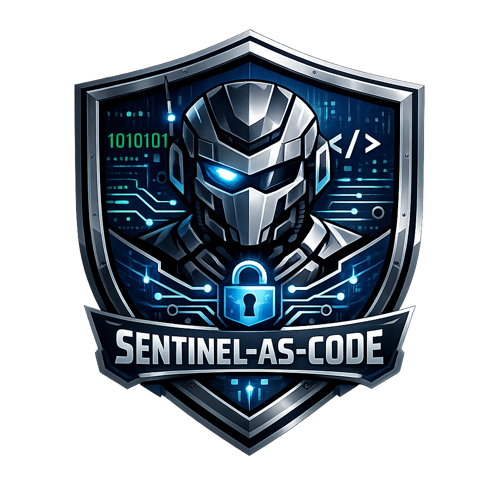

  

# Documentation

The `Docs/` tree mirrors the repository layout: each folder documents the
same-named folder in the repo, so the docs for a piece of code live under the
matching path (`Deploy/` maps to `Docs/Deploy/`, `Pipelines/` to
`Docs/Pipelines/`, `.github/` to `Docs/GitHub/`, and so on). Three folders have no
code counterpart and are grouped by concern instead: `Guides/`, `Releases/` and `Toolkit/`
(the companion VS Code extension, which lives in a separate repository).

## Content - `Content/`

Schemas and conventions for every content type the repo deploys. The Toolkit
schemas and templates are the authoring source of truth for these; each doc
cross-links the matching [Toolkit](#toolkit--companion-vs-code-extension) pages.

| Doc | What it covers |
| --- | --- |
| [Analytical Rules](Content/Analytical-Rules.md) | YAML schema for custom analytics rules: required fields, canonical order, deploy behaviour, Scheduled vs NRT examples |
| [Automation Rules](Content/Automation-Rules.md) | JSON schema for automation rules: trigger conditions, action types (ModifyProperties, RunPlaybook, AddIncidentTask) |
| [Community Rules](Content/Community-Rules.md) | Opt-in third-party rule contributions: deployment defaults, current sources, adding new contributors |
| [Defender Custom Detections](Content/Defender-Custom-Detections.md) | Defender XDR YAML schema, Graph API, response actions, impacted-asset identifiers |
| [Hunting Queries](Content/Hunting-Queries.md) | YAML schema for hunting queries: required fields, tactics/techniques tags, export guide |
| [Parsers](Content/Parsers.md) | YAML schema for KQL parsers/functions deployed as workspace saved functions (stage 1 of the content deploy order) via the `savedSearches` API |
| [Playbooks](Content/Playbooks.md) | ARM template requirements, MSI vs standard connections, auto-injected parameters |
| [Summary Rules](Content/Summary-Rules.md) | Summary-rule JSON schema, allowed bin sizes, KQL restrictions, system columns |
| [Watchlists](Content/Watchlists.md) | Watchlist metadata schema, CSV format, KQL usage examples |
| [Workbooks](Content/Workbooks.md) | Gallery-template JSON format, stable GUIDs, export from the Sentinel portal |

Auto-generated community summaries live under `Content/Community/` (one file per
contributor, written by [`Tools/Import-CommunityRules.ps1`](../Tools/Import-CommunityRules.ps1)
with per-category rule listings and last-sync metadata). Do not hand-edit them.
Current: [Dalonso](Content/Community/Dalonso.md) (David Alonso, see
[Community Rules](Content/Community-Rules.md#david-alonso--threat-hunting-rules)).

## Deploy - `Deploy/`

The PowerShell scripts that reach Sentinel and their one-off setup.

| Doc | What it covers |
| --- | --- |
| [Scripts](Deploy/Scripts.md) | PowerShell deploy and tooling scripts: parameters, examples, known limitations |
| [PR Validation Setup](Deploy/PR-Validation-Setup.md) | One-off GitHub Actions OIDC federated-credential setup for the `arm-validate` PR job |
| [ADO OIDC Setup](Deploy/ADO-OIDC-Setup.md) | One-off Azure DevOps workload-identity-federation setup for `sc-sentinel-as-code` |
| [PowerShell Module Requirements](Deploy/PowerShell-Module-Requirements.md) | Every PowerShell module, external binary, and Azure/Entra/Graph permission the scripts need, split by validate vs use |

## GitHub - `.github/`

| Doc | What it covers |
| --- | --- |
| [GitHub Copilot](GitHub/GitHub-Copilot.md) | Copilot customisations shipped with the repo: instructions, agents, prompts (cross-platform: github.com and every supported IDE) |

## Infra - `Infra/`

Azure resources that host Sentinel content.

| Doc | What it covers |
| --- | --- |
| [Bicep](Infra/Bicep.md) | Subscription-scoped templates, parameters, dual onboarding mechanism, diagnostic settings, optional playbook RG |

## Modules - `Modules/`

| Doc | What it covers |
| --- | --- |
| [Sentinel Common Module](Modules/Sentinel-Common-Module.md) | The shared `Modules/Sentinel.Common` module (SemVer 1.1.1): `Write-PipelineMessage`, `Invoke-SentinelApi`, `Connect-AzureEnvironment` and the KQL-discovery helpers reused across the deployer scripts |

## Pipelines - `Pipelines/` (and `.github/workflows/`)

Seven Azure DevOps pipelines mirrored by seven GitHub Actions workflows. Start at
the index for the GitHub/ADO parity map, then the per-pipeline pages.

| Doc | What it covers |
| --- | --- |
| [Pipelines index](Pipelines/README.md) | GitHub/ADO parity map, shared concepts (OIDC, variable group, composite actions), and links to every per-pipeline page |
| [PR Validation](Pipelines/PR-Validation.md) | The five-job PR-merge gate on both CI systems: Pester, Bicep build, ARM validate, KQL validate, dependency-manifest drift |
| [PR Template Validation](Pipelines/PR-Template-Validation.md) | GitHub-only check that fails a PR whose description leaves the required template sections empty |
| [Deploy](Pipelines/Deploy.md) | The main end-to-end deploy: infra, Content Hub, custom content, Defender XDR (stages, variable group, parameters, service connection, usage) |
| [Deploy Nightly](Pipelines/Deploy-Nightly.md) | GitHub-only nightly E2E smoke test against the throwaway `Infra/test-workspace/` |
| [Drift Detect](Pipelines/Drift-Detect.md) | Portal-drift detection and the auto-PR that absorbs it back into the repo, on both CI systems |
| [Documenter](Pipelines/Documenter.md) | CI/CD wiring for the Sentinel Documenter (daily on GitHub, manual-trigger-only on ADO) |
| [Dependency Update](Pipelines/Dependency-Update.md) | Daily `dependencies.json` drift check and auto-PR |
| [DCR Inventory](Pipelines/DCR-Inventory.md) | CI/CD wiring for the DCR-watchlist sync automation account and runbook |
| [Word Report](Pipelines/Word-Report.md) | ADO-only pipeline that renders the Documenter Markdown pack into a page-numbered Word `.docx` |

## Tests - `Tests/`

| Doc | What it covers |
| --- | --- |
| [Pester Tests](Tests/Pester-Tests.md) | Running and extending the Pester suite, the AST-extraction pattern this repo uses, and the CI gate |

## Tools - `Tools/`

CI, maintenance, and reporting that runs *around* deployment.

| Doc | What it covers |
| --- | --- |
| [Dependency Manifest](Tools/Dependency-Manifest.md) | Auto-derived `dependencies.json` from KQL discovery; PR-validation drift gate; daily auto-PR refresh |
| [Sentinel Drift Detection](Tools/Sentinel-Drift-Detection.md) | Daily detection of portal-edited rules with auto-PR back into the repo |
| [DCR Watchlist Sync](Tools/DCR-Watchlist.md) | Auto-populated DCR inventory watchlist, billing reporting, runbook deployment |
| [SDL Migration Workbook Export](Tools/SDL-Migration-Workbook-Export.md) | Read-only `Export-SdlMigrationWorkbook.ps1` that mirrors every Sentinel Data Lake Migration workbook dataset into one multi-sheet `.xlsx` |

### Documenter - `Tools/Documenter/`

The read-only documentation generator.

| Doc | What it covers |
| --- | --- |
| [Sentinel Documenter](Tools/Documenter/Sentinel-Documenter.md) | Read-only daily inventory + gap-analysis that renders a Markdown documentation pack from a live workspace |
| [Renderer Design](Tools/Documenter/Documenter-Renderer-Design.md) | Design spec for the Markdown renderer: what drives each chart and section |
| [References & Conventions](Tools/Documenter/Documenter-References.md) | Durable record of every API version, module, KQL query, and Learn page the Documenter relies on (rendered as `99-references.md`) |
| [Data Lake Coverage](Tools/Documenter/Sentinel-Data-Lake-Coverage.md) | What the Documenter captures and renders for the Microsoft Sentinel data lake tier |
| [Word Report](Tools/Documenter/Sentinel-Word-Report.md) | The Report toolchain (pandoc for the document, LibreOffice/UNO for the real table of contents) behind the ADO Word-Report pipeline |

## Toolkit - companion VS Code extension

The Sentinel as Code Toolkit is a separate repository (a VS Code extension) for
authoring the content types this repo deploys. It authors and validates; it does
not deploy. Its schemas and templates are the authoring source of truth for the
[Content](#content--content) docs.

| Doc | What it covers |
| --- | --- |
| [Toolkit overview](Toolkit/README.md) | What the extension is, the author/deploy boundary, installation, licence, and feedback channel |
| [Commands](Toolkit/Commands.md) | Every command the extension contributes, grouped by task, with palette titles and keybindings |
| [Templates](Toolkit/Templates.md) | The bundled starter templates, canonical field order, and which content types are authored as YAML and converted to JSON with **Convert Content YAML to JSON** |
| [Schemas and Validation](Toolkit/Schemas-and-Validation.md) | The seven bundled schemas, how validation is triggered, and MITRE ATT&CK multi-framework checking |
| [Configuration](Toolkit/Configuration.md) | Every `sentinelAsCode.*` setting, its default, and the custom-connectors file |
| [ARM to YAML Conversion](Toolkit/ARM-to-YAML-Conversion.md) | Decompiling `Microsoft.SecurityInsights/alertRules` ARM templates into clean analytics-rule YAML |
| [Defender Workflows](Toolkit/Defender-Workflows.md) | Formatting, validating, and converting Defender XDR custom detections for the repository |
| [Graph API Migrations](Toolkit/Graph-API-Migrations.md) | Upcoming Microsoft Graph `security` API deprecations affecting Defender custom detections (migration tracking) |

## Guides

End-to-end walkthroughs. No code counterpart.

| Doc | What it covers |
| --- | --- |
| [Build and Test Guide](Guides/Sentinel-As-Code-Build-and-Test-Guide.md) | Running and validating Sentinel-As-Code without a local PowerShell install: requirements, build/test steps, and deployment |

## Releases

Versioning scheme and the customer-facing changelog. No code counterpart.

| Doc | What it covers |
| --- | --- |
| [Versioning](Releases/Versioning.md) | CalVer (`YY.0M`) scheme, how releases are cut as GitHub Releases (no git tags), the wave to CalVer history, and how repo CalVer relates to the `Sentinel.Common` module's SemVer |
| [Changelog](Releases/CHANGELOG.md) | Customer-facing summary of changes per release |
| [Layout Restructure 26.06](Releases/Layout-Restructure-26.06.md) | Old to new path map for the by-concern restructure and the fork-migration steps |

## Conventions

- **Structure mirrors the repo.** A doc for code under `X/` lives under
  `Docs/X/`. Only `Releases/` and `Toolkit/` (concern-based, no code folder) are
  exceptions.
- **Folder landing page**: `README.md` (GitHub renders it when you open the
  folder). The master index is this file.
- **Filenames**: `Title-Case-With-Hyphens.md`. Acronyms stay uppercase (`ARM`,
  `DCR`, `KQL`, `NRT`, `OIDC`, `PR`, `SDL`, `YAML`); joining words lowercase
  (`to`, `and`, `of`, `for`). No spaces, no leading numbers.
- **Cross-links**: relative. From a doc at `Docs/{Folder}/X.md` the repo root is
  `../../`. The link checker in [Pester Tests](Tests/Pester-Tests.md) enforces
  that every relative link resolves.
- **Adding a new doc**: place it under the folder that mirrors the code it
  documents. If it documents no specific code folder, use (or propose) a
  concern-based folder rather than dropping it at the `Docs/` root.
